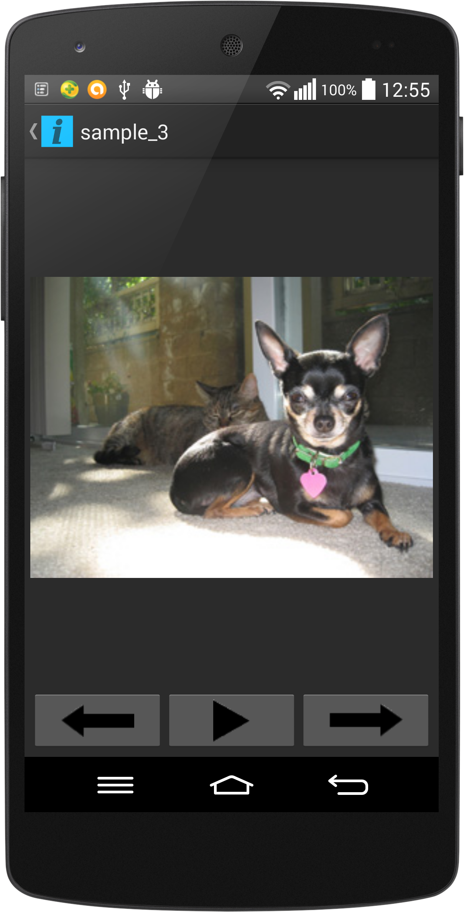

# Assignment 3 - Basic Android Image Viewer
#### Author: Jethro Muller
#### Student Number: MLLJET001
#### Date: 4 September 2014

## Description

Basic Image Viewer application. Shows all images in the root directory of your device in a grid.
If you click an image, it makes it larger and shows the controls for next and previous image as well
as the button that starts the slideshow.

It has gesture functionality too. You can swipe to change the images.

## Instructions

1. Have an android phone with USB Debugging enabled. ([Instructions for the latter]
(http://developer.android.com/tools/device.html#developer-device-options))

2. Navigate to the root directory of this project.

3. Run `./gradlew build`

4. With your android phone plugged in, run `./gradlew installDebug`. This will install the
application directly to your phone.

5. Run the application on your phone.

## Acknowledgements

[Sample images](http://developer.android.com/shareables/sample_images.zip) used in the gallery are from the [GridView example](http://developer.android.com/guide/topics/ui/layout/gridview.html) on developer.android.com.

Two additional animation xml files are taken from the Android Open Source Project.
