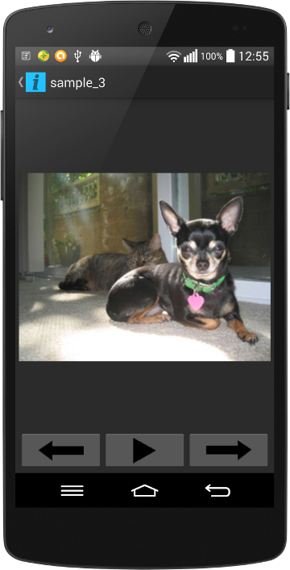

# Assignment 3 - Basic Android Image Viewer
#### Author: Jethro Muller
#### Student Number: MLLJET001
#### Date: 4 September 2014

## Description

Basic Image Viewer application. Shows all images in the root directory of your device.
Each image is displayed above the navigation controls.

There is a button for previous, start slideshow and next.

It has basic gesture functionality in that you can swipe to change images.

## Instructions

1. Have an android phone with USB Debugging enabled. ([Instructions for the latter]
(http://developer.android.com/tools/device.html#developer-device-options))

2. Navigate to the root directory of this project.

3. Run `./gradlew build`

4. With your android phone plugged in, run `./gradlew installDebug`. This will install the
application directly to your phone.

5. Run the application on your phone.

